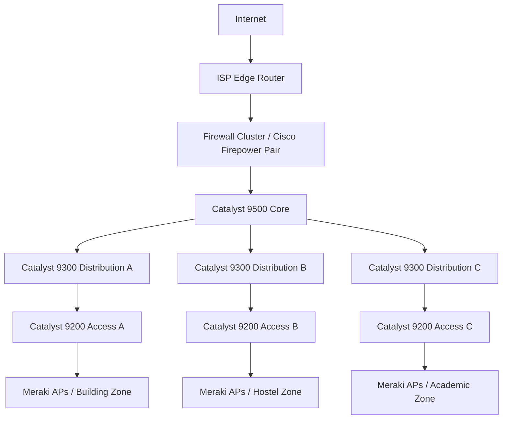
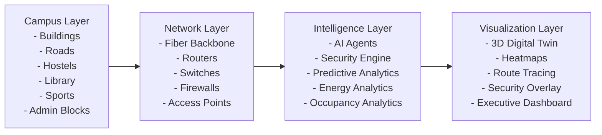
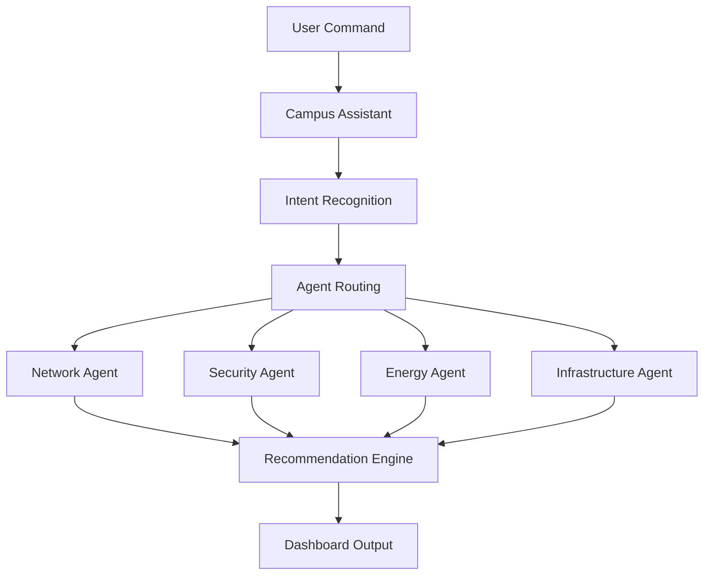

# 🚀 CampusSphere AI

## AI-Powered Smart Campus Network Operations Center

> Transforming traditional campuses into autonomous, self-healing, AI-driven smart campuses.


---

## 🌟 1. Project Overview

CampusSphere AI is a next-generation **Smart Campus Operating System** that combines:

- 🌐 Cisco-grade networking principles
- 🤖 AI-assisted operations
- 🔐 Cybersecurity monitoring views
- 🏢 Campus digital twin visualization
- 📡 Real-time network analytics
- ⚡ Energy intelligence
- 🎥 Smart CCTV insights
- 📈 Predictive analytics
- 🎤 AI voice command center

into a unified intelligent command platform.

The system enables universities and smart campuses to monitor, secure, optimize, and automate infrastructure from one centralized dashboard.

---

## 🎯 Problem Statement

Modern campuses face challenges such as:

- Fragmented infrastructure monitoring
- Poor network visibility
- Delayed incident response
- High energy consumption
- Limited predictive maintenance
- Security vulnerabilities
- Lack of centralized management

CampusSphere AI addresses these through a real-time, operator-first digital campus command center.

---

## 💡 Solution

CampusSphere AI creates a live virtual representation of campus operations and overlays:

- Network Infrastructure
- Security Intelligence
- IoT & occupancy context
- Energy insights
- AI recommendations

This allows administrators to monitor and control campus operations in near real time.

---

## 🏗 System Architecture



---

## 🗺 Digital Twin Architecture



---

## 🔥 Key Features

### 🏢 Campus Digital Twin

- Interactive campus visualization
- Real-time building status
- Fiber route mapping
- Network overlay layers
- Occupancy monitoring

### 🌐 Network Operations Center

- Live topology monitoring
- Packet flow visualization
- Bandwidth analytics
- Latency monitoring
- Route tracing and path analysis

### 📶 Wi-Fi Intelligence

- Coverage heatmaps
- AP monitoring
- Congestion detection
- Signal optimization

### 🔐 Security Operations Center

- Threat detection panels
- Rogue device identification
- Security scoring and alerts

### 🎥 Smart CCTV Analytics

- Crowd and intrusion indicators
- Restricted zone watch
- Incident tracking workflows

### ⚡ Energy Intelligence Center

- Energy trend monitoring
- Consumption forecasting
- Sustainability awareness

### 🤖 AI Command Center

Multi-agent operation model:

- **Network Agent** – Optimizes performance
- **Security Agent** – Detects and responds to threats
- **Infrastructure Agent** – Tracks operational assets
- **Energy Agent** – Improves efficiency
- **Campus Assistant** – Guides operator workflows

### 🎤 AI Voice Command Center

Example commands:

```text
Show H-Block status
Generate security report
Find disconnected APs
Trace internet path
Predict network load
Show occupancy heatmap
```

### 🚀 Campus Autopilot

Autonomous mode for:

- Anomaly detection
- Wi-Fi optimization suggestions
- Predictive failure alerts
- Automated report assistance

---

## 🧠 AI Workflow



---

## 🛠 Tech Stack

### Frontend

- React
- TypeScript
- Vite
- Tailwind CSS
- Three.js
- Recharts

### Backend

- FastAPI
- Python

### Data Layer

- MongoDB Atlas (current integration)
- PostgreSQL / Redis (planned roadmap support)

### AI Layer

- AI command orchestration patterns
- Voice command intent/target workflow
- Extensible design for OpenAI / Gemini / LangGraph / CrewAI integrations

### Infrastructure

- Docker
- Docker Compose
- Kubernetes / Nginx (future deployment path)

---

## 📊 Dashboard Modules

- **Mission Control Dashboard:** Global campus health overview
- **Campus Digital Twin:** Map-first campus visualization
- **Network Operations Center:** Network telemetry and traffic insights
- **Wi-Fi Intelligence Center:** Wireless quality and AP analytics
- **Security Operations Center:** Threat and risk visibility
- **Device Inventory Center:** Infrastructure asset visibility
- **Smart CCTV Analytics:** Video operations intelligence
- **Energy Intelligence Center:** Sustainability and energy analytics
- **Predictive Analytics Center:** Forecasting and proactive insights
- **AI Command Center:** AI-assisted decision workflows
- **Campus Autopilot:** Autonomous operation assistant
- **Executive Analytics Center:** Leadership-level KPI dashboards
- **AI Voice Command Center:** Conversational operational control
- **Incident Command Center:** Incident triage and response view

---

## 🗂 Repository Structure

```text
.
├─ backend/
│  ├─ main.py
│  ├─ requirements.txt
│  ├─ Dockerfile
│  └─ .env (local runtime config)
├─ frontend/
│  ├─ src/
│  │  ├─ App.tsx
│  │  ├─ main.tsx
│  │  └─ styles.css
│  ├─ package.json
│  ├─ vite.config.ts
│  └─ Dockerfile
├─ docker-compose.yml
└─ README.md
```

---

## ▶️ Run Locally

1. Start backend:
   - `cd backend`
   - `pip install -r requirements.txt`
   - `uvicorn main:app --reload --host 0.0.0.0 --port 8000`

2. Start frontend:
   - `cd frontend`
   - `npm install`
   - `npm run dev -- --host 0.0.0.0`

3. Open: `http://127.0.0.1:5173`

### Docker

- `docker compose up --build`

---

## 🏆 Cisco Ideathon Impact

CampusSphere AI demonstrates:

- ✅ Smart campus innovation
- ✅ Cisco networking-aligned architecture thinking
- ✅ Digital twin-first operations
- ✅ AI-assisted NOC/SOC convergence
- ✅ Enterprise observability mindset

---

## 🔮 Future Roadmap

- SD-WAN integration
- IoT sensor stream integration
- Smart identity and access federation
- Drone surveillance integration
- Smart parking analytics
- AR/VR campus twin experience
- Edge AI deployment

---

## 👨‍💻 Team

Built with passion for innovation in networking, cybersecurity, cloud-native systems, and AI-powered operations.

---

## 📜 License

MIT License

---

## 🌟 Final Vision

CampusSphere AI transforms universities into self-healing, self-optimizing, intelligent digital campuses powered by AI, networking, cybersecurity, and real-time observability.
